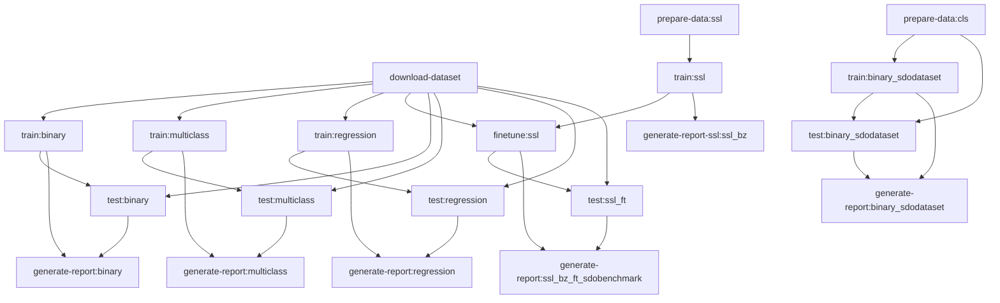

# Pipeline

```mermaid
graph TD;
download-dataset --> train:binary
download-dataset --> train:multiclass
download-dataset --> train:regression
prepare-data:cls --> train:binary_sdodataset
prepare-data:ssl --> train:ssl
train:ssl --> finetune:ssl
download-dataset --> finetune:ssl
download-dataset --> test:binary
train:binary --> test:binary
download-dataset --> test:multiclass
train:multiclass --> test:multiclass
download-dataset --> test:regression
train:regression --> test:regression
prepare-data:cls --> test:binary_sdodataset
train:binary_sdodataset --> test:binary_sdodataset
download-dataset --> test:ssl_ft
finetune:ssl --> test:ssl_ft
train:binary --> generate-report:binary
test:binary --> generate-report:binary
train:multiclass --> generate-report:multiclass
test:multiclass --> generate-report:multiclass
train:regression --> generate-report:regression
test:regression --> generate-report:regression
train:binary_sdodataset --> generate-report:binary_sdodataset
test:binary_sdodataset --> generate-report:binary_sdodataset
finetune:ssl --> generate-report:ssl_bz_ft_sdobenchmark
test:ssl_ft --> generate-report:ssl_bz_ft_sdobenchmark
train:ssl --> generate-report-ssl:ssl_bz
```
