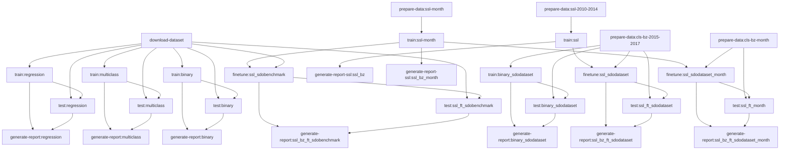

# Pipeline

```mermaid
graph TD;
download-dataset --> train:binary
download-dataset --> train:multiclass
download-dataset --> train:regression
prepare-data:cls-bz-2015-2017 --> train:binary_sdodataset
prepare-data:ssl-2010-2014 --> train:ssl
prepare-data:ssl-month --> train:ssl-month
train:ssl-month --> finetune:ssl_sdobenchmark
download-dataset --> finetune:ssl_sdobenchmark
train:ssl --> finetune:ssl_sdodataset
prepare-data:cls-bz-2015-2017 --> finetune:ssl_sdodataset
train:ssl-month --> finetune:ssl_sdodataset_month
prepare-data:cls-bz-month --> finetune:ssl_sdodataset_month
download-dataset --> test:binary
train:binary --> test:binary
download-dataset --> test:multiclass
train:multiclass --> test:multiclass
download-dataset --> test:regression
train:regression --> test:regression
prepare-data:cls-bz-2015-2017 --> test:binary_sdodataset
train:binary_sdodataset --> test:binary_sdodataset
download-dataset --> test:ssl_ft_sdobenchmark
finetune:ssl_sdobenchmark --> test:ssl_ft_sdobenchmark
prepare-data:cls-bz-2015-2017 --> test:ssl_ft_sdodataset
finetune:ssl_sdodataset --> test:ssl_ft_sdodataset
prepare-data:cls-bz-month --> test:ssl_ft_month
finetune:ssl_sdodataset_month --> test:ssl_ft_month
train:binary --> generate-report:binary
test:binary --> generate-report:binary
train:multiclass --> generate-report:multiclass
test:multiclass --> generate-report:multiclass
train:regression --> generate-report:regression
test:regression --> generate-report:regression
train:binary_sdodataset --> generate-report:binary_sdodataset
test:binary_sdodataset --> generate-report:binary_sdodataset
finetune:ssl_sdobenchmark --> generate-report:ssl_bz_ft_sdobenchmark
test:ssl_ft_sdobenchmark --> generate-report:ssl_bz_ft_sdobenchmark
finetune:ssl_sdodataset --> generate-report:ssl_bz_ft_sdodataset
test:ssl_ft_sdodataset --> generate-report:ssl_bz_ft_sdodataset
finetune:ssl_sdodataset_month --> generate-report:ssl_bz_ft_sdodataset_month
test:ssl_ft_month --> generate-report:ssl_bz_ft_sdodataset_month
train:ssl --> generate-report-ssl:ssl_bz
train:ssl-month --> generate-report-ssl:ssl_bz_month
```
